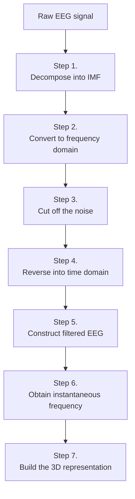

# Instantaneous3D_EEG_SignalAnalysis

Paper reproduction: Instantaneous 3D EEG Signal Analysis Based on Empirical Mode Decomposition and the Hilbert–Huang Transform Applied to Depth of Anaesthesia

## 名词

+ DoA: Depth of anaesthesia（麻醉深度）
+ EEG: electroencephalography（脑电图学）
+ EMD: empirical mode decomposition（经验模态分解）
+ HHT: Hilbert–Huang transform（希尔伯特-黄变换）
+ IMFs: intrinsic mode functions（固有模态函数）
+ IMF: intrinsic mode functions（固有模态函数）
+ SampEn: sample entropy（样本熵）
+ BIS: bispectral index（脑电双频指数）
+ ECG: electrocardiography（心电描记术）
+ FFT: Fast Fourier Transform（快速傅里叶变换）
+ AUC ratio of α + β waves: area ratio of α + β waves (8–32 Hz) under FFT curve（快速傅立叶变换曲线下α+β波(8-32赫兹)的面积比）

## 论文内容

### 摘要

麻醉的程度(DoA)是评估全身麻醉剂对患者中枢神经系统抑制程度的重要指标。通过监测病人脑电信号（electroencephalography(EEG)）来判断病人是否处于全麻状态有助于调节DoA并减轻手术的风险。

### 介绍

EMD可以从原始EEG信号中滤除噪音相关的频率，并可以结合挑选出来的固有模态函数得到滤波后的EEG信号。之后在滤波后的EEG信号的基础上用HHT得到瞬时频率和瞬时振幅。

之后就可以用“瞬时频率、瞬时振幅和EEG信号中的时间元素”重组并构建 可以实时显示脑电信号振幅和频率的 实时3D表示图。

### 方法

