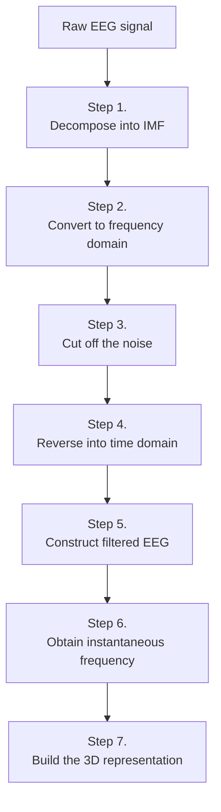

# Instantaneous3D_EEG_SignalAnalysis

Paper reproduction: Instantaneous 3D EEG Signal Analysis Based on Empirical Mode Decomposition and the Hilbert–Huang Transform Applied to Depth of Anaesthesia

+ Project URL: [http://github.com/LetMeFly666/Instantaneous3D_EEG_SignalAnalysis/](http://github.com/LetMeFly666/Instantaneous3D_EEG_SignalAnalysis/)
+ Online Address: [https://i3deegsa.letmefly.xyz/](https://i3deegsa.letmefly.xyz/)
+ Release: [i3deegsa-v0.0.1-Py3.8.8-x32.exe](https://github.com/LetMeFly666/Instantaneous3D_EEG_SignalAnalysis/releases/download/v0.1.0/i3deegsa-v0.0.1-Py3.8.8-x32.exe) （仅支持读取相同目录下的[case7.txt](https://github.com/LetMeFly666/Instantaneous3D_EEG_SignalAnalysis/releases/download/v0.1.0/case7.txt)）

## 名词

+ DoA: Depth of anaesthesia（麻醉深度）
+ EEG: electroencephalography（脑电图学）
+ EMD: empirical mode decomposition（经验模态分解）
+ HHT: Hilbert–Huang transform（希尔伯特-黄变换）
+ HT: Hilbert transform（希尔伯特变换）
+ IMF: intrinsic mode functions（固有模态函数）
+ SampEn: sample entropy（样本熵）
+ BIS: bispectral index（脑电双频指数）
+ ECG: electrocardiography（心电描记术）
+ FFT: Fast Fourier Transform（快速傅里叶变换）
+ AUC ratio of α + β waves: area ratio of α + β waves (8–32 Hz) under FFT curve（快速傅立叶变换曲线下α+β波(8-32赫兹)的面积比）
+ EMG: electromyography（肌电图描记法）
+ EOG: electrooculography（眼动电图描记法）
+ ESUs: electrosurgical units（电外科装置）
+ IFFT: Inverse fast Fourier transform（快速傅里叶逆变换）
+ ApEn: approximate entropy（近似熵）

## 预备知识

### 时域和频域

时域是客观世界中唯一实际存在域；频域是一个数学构造，也被一些学者称为上帝视角。

#### 时域

以时间轴为坐标表示动态信号的关系

#### 频域

正弦波是频域中唯一存在的波形

#### 转换

动态信号从时间域变换到频率域主要通过傅立叶级数和傅立叶变换实现。周期信号靠傅立叶级数，非周期信号靠傅立叶变换。时域越宽，频域越短。

## 论文内容

### 摘要

麻醉的程度(DoA)是评估全身麻醉剂对患者中枢神经系统抑制程度的重要指标。通过监测病人脑电信号（electroencephalography(EEG)）来判断病人是否处于全麻状态有助于调节DoA并减轻手术的风险。

### 介绍

EMD可以从原始EEG信号中滤除噪音相关的频率，并可以结合挑选出来的固有模态函数得到滤波后的EEG信号。之后在滤波后的EEG信号的基础上用HHT得到瞬时频率和瞬时振幅。

之后就可以用“瞬时频率、瞬时振幅和EEG信号中的时间元素”重组并构建 可以实时显示脑电信号振幅和频率的 实时3D表示图。

### 方法



#### step1 将原有EEG信号分解为数个IMF

$$x(t)=\sum_{i=1}^{n} c_{i}(t)+r_{n}(t)$$

$x(t)$是时域下的原始信号，$c_i(t)$是第$i$个IMF（固有模态函数），$r_n(t)$是残余信号。

#### step2 将IMF转换到频域

使用FFT将IMF从时域转换到频域。

#### step3 去除每个IMF中的噪声

人脑产生的脑电信号的正常频率在0.5赫兹Hz到32Hz之间，它们分别包含从低频到高频的δ，θ，α波和β波。

#### step4 将IMF转回到时域

使用快速傅立叶逆变换IFFT

#### step5 构造滤波后的脑电信号的IMF

IFFT带来的边缘效应会使前5秒和后5秒的振幅异常地高，因此去掉前5秒和后5秒。

丢掉过小的IMF。

#### step6 通过HHT获得实时频率

δ (0.5–4 Hz), θ (4–8 Hz), α (8–16 Hz), β (16–32 Hz)

Other: Noise

#### step7 构建三维表示

x轴：频率，y轴：时间，z轴：振幅

## 实现

+ ```Codes/main.py```：主程序，主要负责调用
+ ```Codes/BaseClass.py```：数据类，包括数据、起始截止时间、采样频率等
+ ```Codes/BaseFunction.py```：一些基本的函数功能
+ ```Codes/Visualize.py```：将数据可视化
+ ```Codes/Txt2numpy.py```：读取数据
+ ```Codes/ShowOriginalEEGdata.py```：显示原始EEG
+ ```Codes/Data2IMFs.py```：将数据分成很多IMF、将IMF转换到频域
+ ```Codes/IMFs2FrequencyDomain.py```：将IMF转换到频域
+ ```Codes/CutoffNoice.py```：将信号中不符合频率范围的部分删除
+ ```Codes/IMF2TimeDomain.py```：将IMF转回时域
+ ```Codes/ConstructEEG.py```：将IMF构建回EEG（并去除前10s的信号）
+ ```Codes/HHT.py```：通过HHT获得实时频率
+ ```Codes/ShowRealtime3D.py```：显示为实时三维图


## TODO:

+ 多种时间的文件的支持（现在只能是固定的4000个数据，并且程序中很多位置使用了绝对值，不好）

<!-- Get-ChildItem Env: | Select Name | Export-Csv -Path C:/Users/LetMe/Desktop/tmp.txt -NoTypeInformation -->
